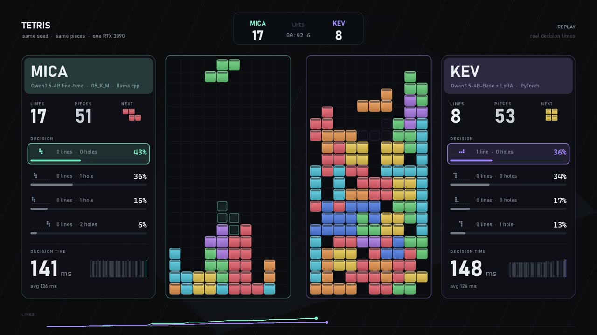
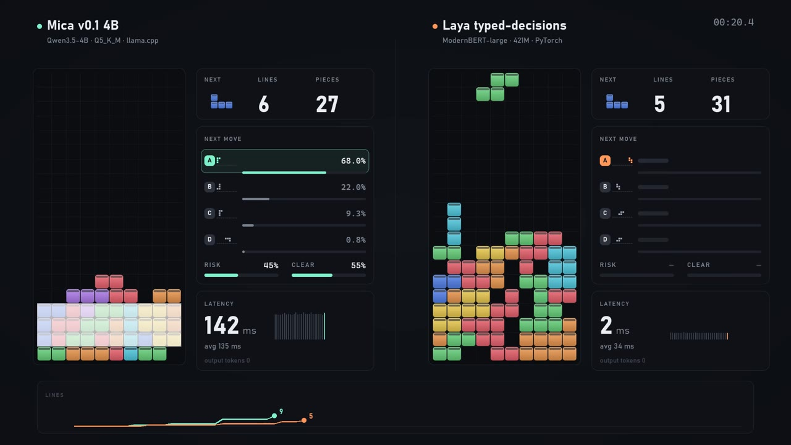

# Tetris-style benchmark: Mica vs N

Decision models play the same Tetris-style game: same seed, same piece order, same shuffled options every turn.
Each move the model gets the board as text plus a handful of possible placements and picks one. Anything that
speaks TypeSafe `/v1/systemone` can play, and so can any Python function you plug in.

| Mica vs Kev 4B (seed 11) | Mica vs Laya (seed 11) |
|:--:|:--:|
| [](videos/mica_vs_kev.mp4) | [](videos/mica_vs_laya.mp4) |
| Kev tops out at piece 86 with 17 lines. Mica is at 37 and still going. | Laya tops out at piece 59 with 8 lines. |

## Results

Three seeds, up to 250 pieces, one RTX 3090. Logs for every move are in [`results/`](results), the table is
[`results/summary.md`](results/summary.md).

**Easy scaffold** (4 options per move, outcomes given as numbers, goal stated in the question)

| Judge | Lines (seed 7 / 11 / 23) | Total | Pieces | Topped out | Picked the best option |
|---|---|---:|---|---:|---:|
| **Mica v0.1 4B** (Q5_K_M) | **33 / 97 / 93** | **223** | 121 / 250 / 250 | 1 of 3 | **75%** |
| Kev 4B | 27 / 17 / 11 | 55 | 107 / 86 / 69 | 3 of 3 | 49% |
| Laya typed-decisions | 4 / 8 / 5 | 17 | 50 / 59 / 52 | 3 of 3 | 27% |

**Base scaffold** (6 options per move, outcomes in words)

| Judge | Lines (seed 7 / 11 / 23) | Total | Pieces | Topped out | Picked the best option |
|---|---|---:|---|---:|---:|
| **Mica v0.1 4B** (Q5_K_M) | 5 / 11 / 9 | **25** | 51 / 65 / 60 | 3 of 3 | **47%** |
| Kev 4B | 6 / 6 / 6 | 18 | 54 / 53 / 52 | 3 of 3 | 30% |
| Laya typed-decisions | 0 / 1 / 3 | 4 | 37 / 40 / 44 | 3 of 3 | 13% |

"Best option" means the top placement by the classic heuristic below. Median decision time was about 136 ms for Mica,
124–138 ms for Kev and 37 ms for Laya; each decision asks three questions about the same board in one request.
Mica and Kev report their own server-side latency, Laya is timed in-process.

## How a move works

1. [`engine.py`](engine.py) simulates every placement of the current piece (rotation × column, hard drop) and scores
   it with `0.76·lines − 0.51·aggregate height − 0.36·holes − 0.18·bumpiness`.
2. The top 4 (easy) or 6 (base) are offered in an order shuffled by the seed, so position gives nothing away.
3. The judge gets one request: the board as `#`/`.` rows with the current and next piece, and three questions:
   - `place` (choice): which placement, each option described by its outcome ("clears 1 line; new holes: 0; ...")
   - `risk` (yes/no): is the stack close to the top?
   - `clear` (yes/no): can this piece complete a row?
4. The chosen placement is played. No history is sent; every move is a fresh question.

## Try it with your own model

```bash
pip install pillow            # ffmpeg on PATH as well if you want videos
```

Start Mica (see the [main README](../../README.md)); we used the Q5_K_M file:

```bash
bash scripts/serve.sh weights/mica-v0.1-4b-Q5_K_M.gguf 8010      # from the repo root
```

Then put it against anything, as many judges as you like:

```bash
cd demos/tetris
python bench.py --judge mica=http://127.0.0.1:8010/v1/systemone \
                --judge yours=http://127.0.0.1:9000/v1/systemone \
                --judge random --judge greedy \
                --seeds 7 11 23 --scaffold easy --out runs
```

- `NAME=URL` is any `/v1/systemone` server. `--model NAME=...` sets the `model` field if your server checks it.
- `NAME=py:file.py[:arg]` loads a Python file with `make_judge(arg)` returning `fn(state, questions)` that gives back a
  `/v1/systemone`-shaped response (`{"answers": {...}}`).
- `random` and `greedy` (always the heuristic's top option) are there as floor and reference.
- `--scaffold base` or `both` runs the harder wording. The table is written to `runs/summary.md`.

Examples for the two models above:
- **Kev 4B**: [`examples/kev.sh`](examples/kev.sh) serves it on :8009 (pinned to the version we tested), then
  `--judge kev=http://127.0.0.1:8009/v1/systemone`.
- **Laya**: [`examples/laya_judge.py`](examples/laya_judge.py) runs it in-process, `--judge laya=py:examples/laya_judge.py`.
- [`examples/mica_vs_kev_laya.sh`](examples/mica_vs_kev_laya.sh) is the whole comparison in `results/`, videos included.

## Make the video

```bash
python render.py runs/easy/mica_s11.jsonl runs/easy/yours_s11.jsonl --pieces 100 --gpu "RTX 3090" --out mica_vs_yours.mp4
python render.py runs/easy/mica_s11.jsonl runs/easy/yours_s11.jsonl --still 40 --out frame.png     # one frame to check
```

It renders two runs head to head in the same style as the Mica vs Kev video (1080p60). The decision time on screen is
the recorded latency of each move. `--name` and `--spec` set the labels. With Bahnschrift and Cascadia Mono installed
(Windows) the text matches our videos; elsewhere it falls back to DejaVu, or set `RENDER_FONT_DIR`.

Tetris is a trademark of The Tetris Company. This is an independent benchmark harness, not affiliated with it.
